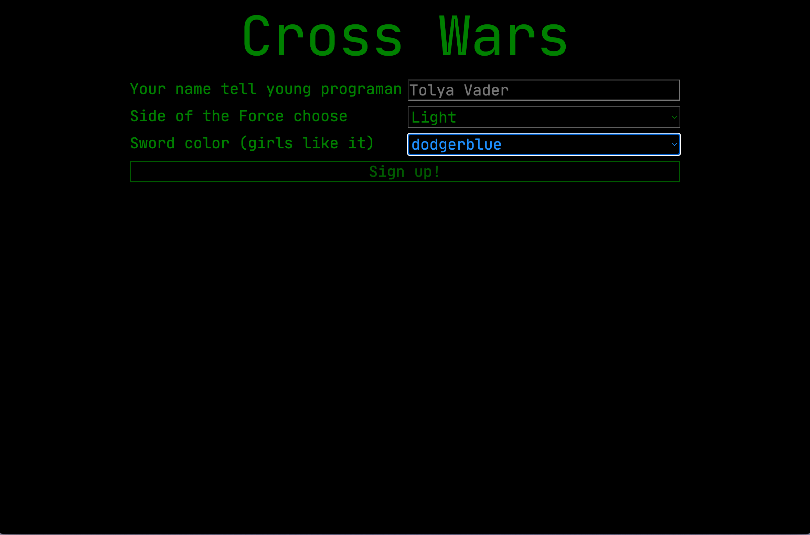
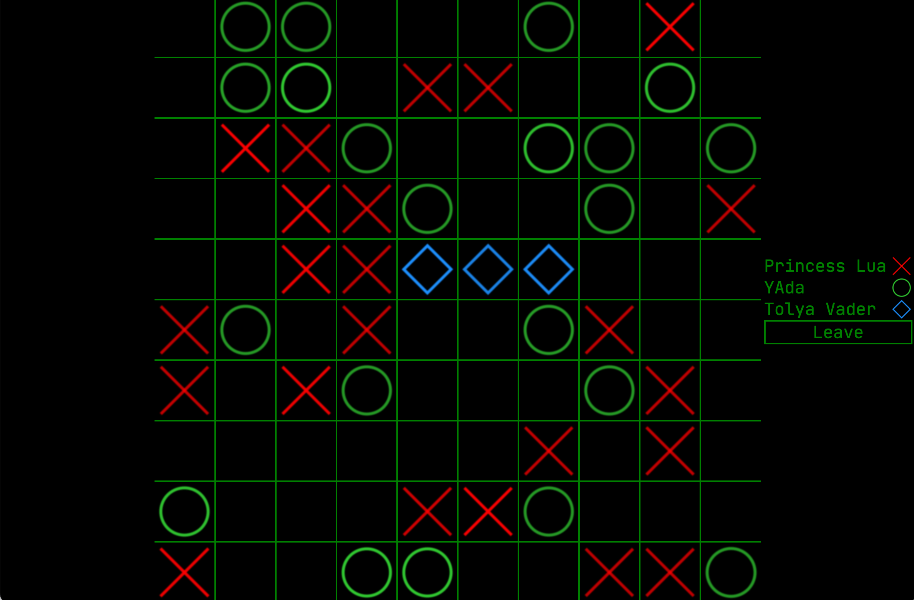
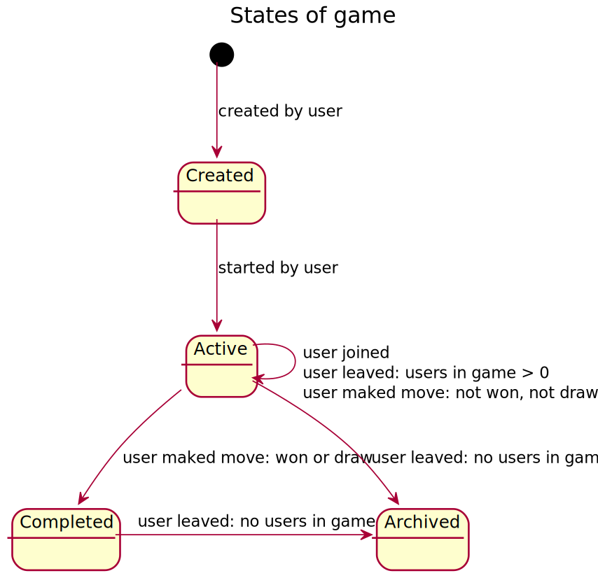
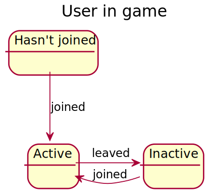
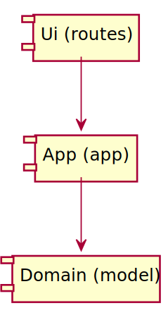
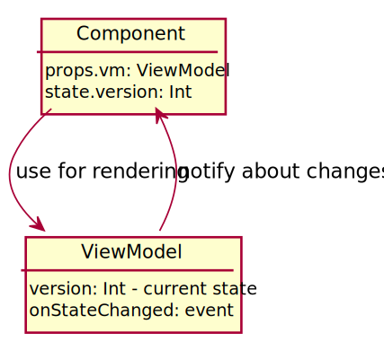
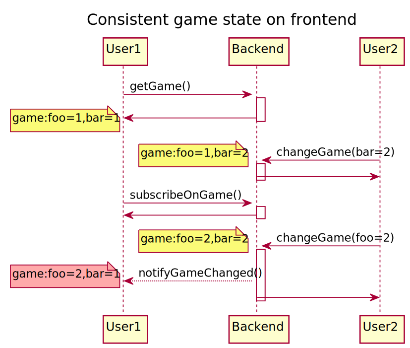
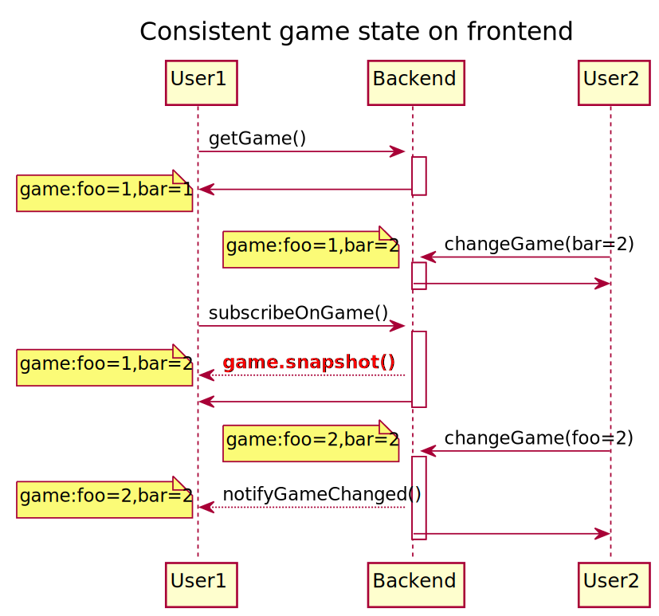

# Cross Wars

- [Задание](#задание)
- [Решение](#решение)
  - [Правила игры](#правила-игры)
  - [Состояния основных сущностей](#состояния-основных-сущностей)
  - [Архитектура](#архитектура)
    - [Серверная часть](#серверная-часть)
    - [Клиентская часть](#клиентская-часть)
  - [Гарантия отображения консистентного состояния игры](#гарантия-отображения-консистентного-состояния-игры)

## Задание

Нужно написать сервис для совместной игры в крестики-нолики.

Игра содержит несколько игровых полей, каждый игрок может либо присоединиться к
игре на существующем поле, либо создать новое поле.

Начальный экран содержит список игровых полей и их краткое описание (сколько
игроков сейчас играет, когда был последний ход). Данные обновляются в реальном времени.

Игровое поле имеет фиксированный размер 10 x 10. На каждом поле могут играть
несколько игроков. Каждый игрок может сделать ход в любой момент, но не может
сделать несколько ходов подряд.

Игровой сервер может хранить состояние игрового процесса в памяти.

## Решение

### Примеры экранов игры

Регистрация

Активные в настоящий момент игры

Игра

### Правила игры

Основные инварианты влияющие на игровой процесс:

* Пользователь в каждый момент времени может играть не более чем в одну игру.
* В одну игру могут играть 1 и более пользователей.
* Каждый игрок может сделать ход в любой момент, но не может сделать несколько
ходов подряд.

В результате последнего инварианта мы получаем довольно любопытное следствие:

* Если играют 2 игрока, то мы имеем классические крестики-нолики, где можно
играть не спеша и сколько угодно обдумывать свои ходы.
* Но легким добавлением дополнительных игроков (чтобы стало 3 и более) игра
превращается в динамический экшн, где нужно быстро принимать решения и на
раздумывания времени нет.

### Состояния основных сущностей

Игра может находиться в следующих состояниях:

Пользователь по отношению к игре может находиться в следующих состояниях:

### Архитектура

#### Серверная часть

Серверная часть находиться в папке /scr/jvmMain.

Код приложения разбит на классические слои:

* UI (папка routes) - реализует http интерфейс приложения и веб сокеты. Здесь
можно посмотреть
какие rest endpoints есть у приложения.
* Application (папка app) - представляет фасад приложения в виде набора сервисов,
который можно обернуть нужным UI слоем (например http, как в данном случае).
Здесь можно посмотреть, что умеет делать приложение.
* Domain (папка model) - реализует бизнес логику приложения. Здесь можно
посмотреть как реализована логика игры, как осуществляется синхронизация и т.д.

Слои подчиняются правилу зависимостей, т.о. нижний слой не зависит от верхнего.

Самые интересные классы:

* Game - логика игры
* GameBoard - логика игрового поля
* User - логика действий пользователя
* SubscriptionsHub - логика подписок пользователей на игровые события.
* WsConnection - логика отправки событий пользователю.

#### Клиентская часть

Клиентская часть находиться в папке /src/jsMain.

Код разбит на слои следующим образом:

* components - React компоненты, отвечают за рисования GUI.
* viewModel - классы модели отображения, отвечают за логику пользовательского
интерфейса: переходы между экранами, выполнение команд, обработка игровых
событий. Отвечают на вопрос, что из себя представляет клиентское приложение функционально,
не отвечая на вопрос, как оно должно отображаться.
* api - реализует взаимодействие с серверной частью, знает какие запросы на
какие endpoints нужно отправлять.

Замечания по взаимодействию components и viewModel:

* Component берет из viewModel данные для отрисовки.
* viewModel хранится в props у component.
* Component.state используется только для уведомления,
что component должен перерисоваться.
* При обновлении состояния viewModel, вызывается метод component.setState
и в state записывается только текущая версия viewModel (инкрементируемое
числовое поле).

Самые интересные классы:

* ViewModel - базовый класс для view models, содержит базовую логику инициализации,
dispose, организации view models в дерево, маршрутизации событий по дереву, а также
уведомления интересующихся (components, например) об изменениях состояния.
* CommandVm - базовый класс для команд, содержит базовую логику выполнения команд,
перехвата ошибок и определения может ли команда быть выполнена.
* VmComponent - базовый класс для компонента, который отображает viewModel. Содержит
логику инициализации viewModel, подписку/отписку на события об изменениях viewModel.
* WsConnection - обеспечивает наличие web socket соединения с сервером, переподключается
если нужно.
* SubscriptionsHub - позволяет view models подписываться на игровые события с сервера.
* GameListVm - список игр на главном экране.
* PlayGameVm - экран игры.
* GameBoardVm - игровое поле.

### Гарантия отображения консистентного состояния игры

Наивная реализация логики отображения изменяемой сущности(игры) на тонком клиенте
выглядит следующим образом:

1. Получили текущее состояние игры.
2. Подписались на события об изменениях.
3. Получаем события об изменения и применяем их к игре.

На следующей диаграмме можно увидеть, какие проблемы есть при таком подходе:

Чтобы решить эту проблему, нужно после подписки отправить в канал клиенту
snapshot актуального состояния сущности(игры). Получив snapshot, клиент
проверяет все части состояния сущности и обновляет что нужно, а дальше получает события
и применяет их. Алгоритм выглядит следующим образом:

1. Получили текущее состояние игры.
2. Подписались на события об изменениях.
3. Получили snapshot игры, проверили все части состояния игры, обновили что нужно.
4. Получаем инкрементальные обновления.

